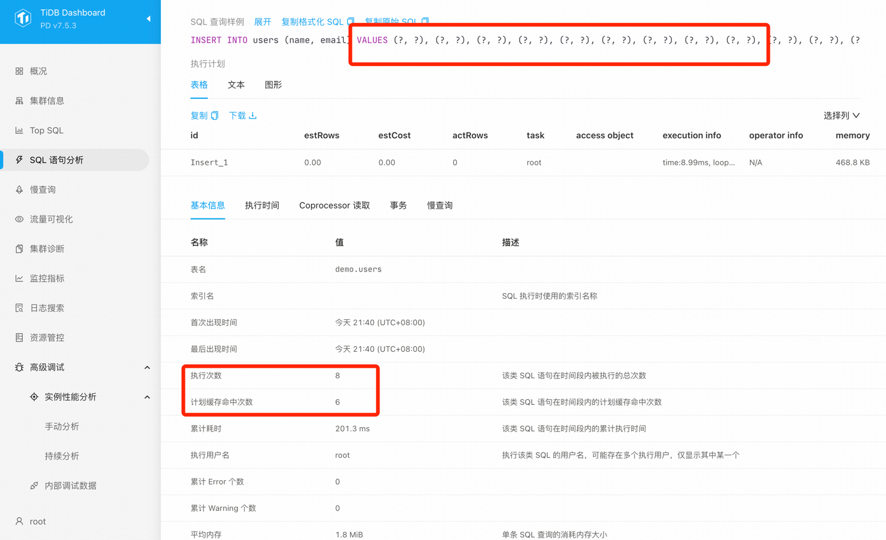

connect to TiDB:
CREATE DATABASE demo;
USE demo;
CREATE TABLE users (
id INT AUTO_INCREMENT PRIMARY KEY,
name VARCHAR(50) NOT NULL,
email VARCHAR(50) NOT NULL
);
set global tidb_opt_fix_control = '44262:ON,44389:ON,44823:2000000,44830:ON,44855:ON,45132:10,52869:ON';

change mybaties-config.xml with right tidb user and password
run Main.java

It can use plan cache:

